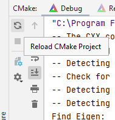

# Installation of Ikarus

This installation guide is tested on Windows.

## Get a working C++ environment

- CLion needs to be installed on your computer.
- Download GCC 11 (C++ compiler) from Winlibs. Choose
  - `GCC 11.1.0 + LLVM/Clang/LLD/LLDB 12.0.0 + MinGW-w64 9.0.0 - release 2`
  -  Win64.
  - 7-zip or zip makes no difference
- Unpack it in any location of your choice
- Tell CLion to use the recently downloaded GCC. In CLion
  - Go to `File --> Settings --> Build, Execution, Deployment --> Toolchains`
  - In the field `Environment`, copy the path where you unpacked the download
    e.g. `C:\myFolder\mySubFolder\mingw64`
  - CLion should now detect CMake, the compilers and the debugger   

## Clone Ikarus

- Clone the Ikarus repository as you do it with any other repository (e.g. using GitKraken)
- ToDo: Describe here how to access it from Github.com
- Open the CMake tab `CMake` in the CLion footer: 
  
- Click on `Reload CMake project` (refresh symbol)  

- CMake now detects all required sources automatically. The output should look similar to
the screenshot below

  

## Further reading:
As the next step: We recommend to read the following pages:
- ToDo
- ToDo
- ...
